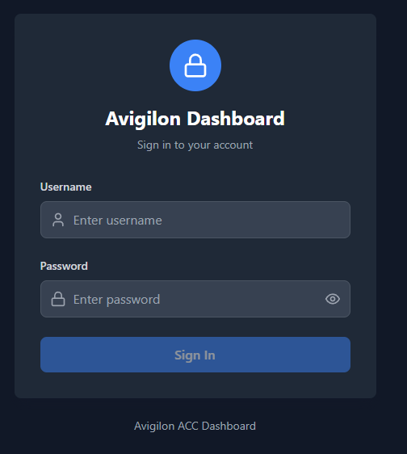
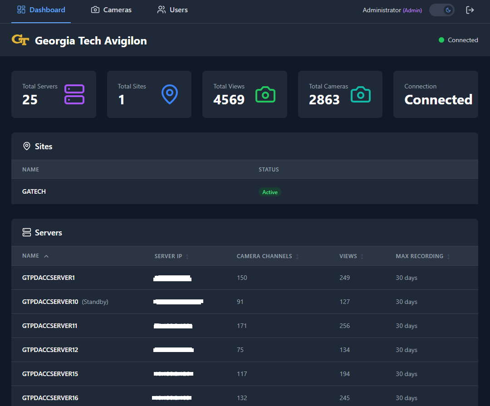
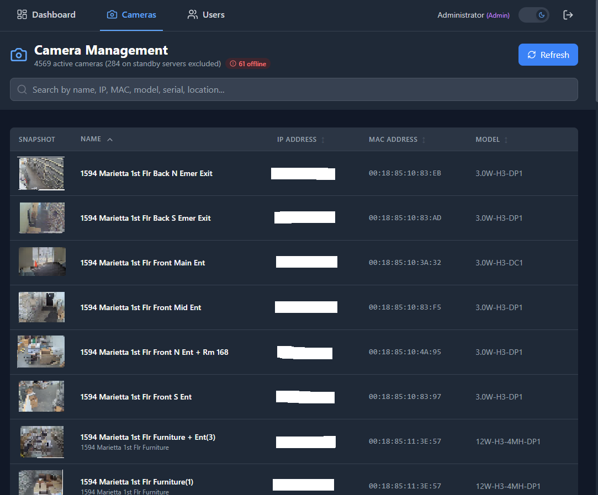
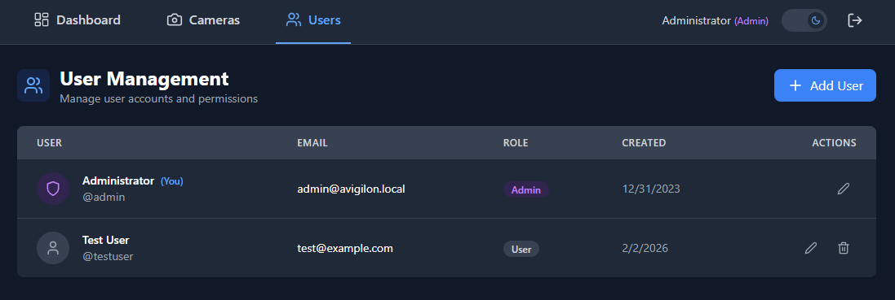

# Avigilon Dashboard

A full-stack web application for managing and monitoring Avigilon Control Center (ACC) cameras and sites. Built with React frontend and Node.js backend.

## 📸 Screenshots

### Login Page


### Dashboard


### Cameras View


### User Management (Admin)


## 🌟 Features

- **User Authentication**: Secure JWT-based login with role-based access control
- **Admin User Management**: Create, edit, and delete user accounts (admin only)
- **Dashboard Overview**: View system statistics, server information, and site summary
- **Camera Management**: Browse all cameras, view snapshots, and manage camera settings
- **Site Information**: Access detailed information about ACC sites
- **Real-time Status**: Monitor connection status and camera availability
- **RESTful API**: Clean API interface to ACC Web Endpoint Service
- **Dark Mode**: Toggle between light and dark themes

## 📋 Prerequisites

Before you begin, ensure you have the following installed:

- **Node.js** (v18 or higher)
- **npm** or **yarn**
- **Avigilon Control Center** (ACC 6 or ACC 7)
- **ACC Web Endpoint Service** installed on your ACC server
- **API Credentials**: User nonce and user key from Avigilon Technology Partner Program

### Getting API Credentials

To use this application, you need to register for the Avigilon Technology Partner Program:

1. Visit the Avigilon Partner Portal
2. Register for API access
3. Obtain your `user_nonce` and `user_key`
4. Ensure the ACC Web Endpoint Service is installed on your ACC server

For more information, visit: https://support.avigilon.com/s/article/How-to-obtain-REST-API-SDK-Support

## 🚀 Quick Start

### 1. Clone or Extract the Project

```bash
cd avigilon-app
```

### 2. Backend Setup

```bash
cd backend

# Install dependencies
npm install

# Create environment file
cp .env.example .env

# Edit .env with your ACC credentials
nano .env  # or use your preferred editor
```

**Configure your `.env` file:**

```env
PORT=3001
NODE_ENV=development

# Your ACC Server Details
ACC_SERVER_URL=http://your-acc-server-ip:8080
ACC_USERNAME=your_username
ACC_PASSWORD=your_password
ACC_USER_NONCE=your_user_nonce_from_avigilon
ACC_USER_KEY=your_user_key_from_avigilon

ALLOWED_ORIGINS=http://localhost:3000,http://localhost:5173
```

**Start the backend:**

```bash
npm start
# or for development with auto-reload:
npm run dev
```

The backend will start on `http://localhost:3001`

### 3. Frontend Setup

Open a new terminal:

```bash
cd frontend

# Install dependencies
npm install

# Start the development server
npm run dev
```

The frontend will start on `http://localhost:3000`

### 4. Access the Application

Open your browser and navigate to:
- Frontend: `http://localhost:3000`
- Backend API: `http://localhost:3001`

### 5. Login

Use the default admin credentials:
- **Username:** `admin`
- **Password:** `Avigilon`

> **Note:** Change the default password after first login for security.

## 📁 Project Structure

```
avigilon-app/
├── backend/
│   ├── src/
│   │   ├── controllers/
│   │   │   ├── avigilonController.js    # ACC request handlers
│   │   │   ├── authController.js        # Login/logout handlers
│   │   │   └── userController.js        # User CRUD handlers
│   │   ├── middleware/
│   │   │   └── authMiddleware.js        # JWT verification
│   │   ├── routes/
│   │   │   ├── api.js                   # ACC API routes
│   │   │   └── auth.js                  # Auth routes
│   │   ├── services/
│   │   │   ├── avigilonService.js       # ACC API integration
│   │   │   └── authService.js           # JWT & user management
│   │   ├── data/
│   │   │   └── users.json               # User data storage
│   │   └── index.js                     # Express server
│   ├── .env.example                     # Environment template
│   └── package.json
│
├── frontend/
│   ├── src/
│   │   ├── components/
│   │   │   ├── ThemeToggle.jsx          # Dark mode toggle
│   │   │   └── ProtectedRoute.jsx       # Auth route guard
│   │   ├── context/
│   │   │   ├── ThemeContext.jsx         # Theme state
│   │   │   └── AuthContext.jsx          # Auth state
│   │   ├── pages/
│   │   │   ├── Dashboard.jsx            # Dashboard page
│   │   │   ├── Cameras.jsx              # Cameras page
│   │   │   ├── Login.jsx                # Login page
│   │   │   └── UserManagement.jsx       # User admin page
│   │   ├── services/
│   │   │   ├── apiService.js            # ACC API client
│   │   │   └── authService.js           # Auth API client
│   │   ├── App.jsx                      # Main app component
│   │   ├── main.jsx                     # Entry point
│   │   └── index.css                    # Global styles
│   ├── index.html
│   ├── vite.config.js
│   ├── tailwind.config.js
│   └── package.json
│
└── docs/
    └── screenshots/                      # Application screenshots
```

## 🔌 API Endpoints

### Authentication Routes (Public)

| Method | Endpoint | Description |
|--------|----------|-------------|
| POST | `/api/auth/login` | Login with username/password |
| POST | `/api/auth/refresh` | Refresh access token |

### Authentication Routes (Protected)

| Method | Endpoint | Description |
|--------|----------|-------------|
| POST | `/api/auth/logout` | Logout user |
| GET | `/api/auth/me` | Get current user info |

### User Management Routes (Admin Only)

| Method | Endpoint | Description |
|--------|----------|-------------|
| GET | `/api/auth/users` | List all users |
| POST | `/api/auth/users` | Create new user |
| PUT | `/api/auth/users/:id` | Update user |
| DELETE | `/api/auth/users/:id` | Delete user |

### ACC API Routes (Protected)

| Method | Endpoint | Description |
|--------|----------|-------------|
| GET | `/api/health` | Health check (public) |
| GET | `/api/test-connection` | Test ACC connection |
| GET | `/api/server/info` | Get ACC server information |
| GET | `/api/sites` | Get all sites |
| GET | `/api/sites/:siteId` | Get site by ID |
| GET | `/api/cameras` | Get all cameras |
| GET | `/api/cameras/:cameraId` | Get camera details |
| GET | `/api/cameras/:cameraId/status` | Get camera status |
| GET | `/api/cameras/:cameraId/snapshot` | Get camera snapshot |
| PUT | `/api/cameras/:cameraId` | Update camera settings |

### Example API Calls

```javascript
// Get all cameras
fetch('http://localhost:3001/api/cameras')
  .then(res => res.json())
  .then(data => console.log(data));

// Get camera snapshot
const snapshotUrl = 'http://localhost:3001/api/cameras/camera-123/snapshot';
```

## 🛠️ Configuration

### Backend Configuration

Edit `backend/.env`:

```env
# Server Port
PORT=3001

# ACC Server Configuration
ACC_SERVER_URL=http://192.168.1.100:8080  # Your ACC server URL
ACC_USERNAME=admin                         # ACC username
ACC_PASSWORD=yourpassword                  # ACC password
ACC_USER_NONCE=your_nonce_here            # From Avigilon Partner Program
ACC_USER_KEY=your_key_here                # From Avigilon Partner Program

# CORS - Add your frontend URLs
ALLOWED_ORIGINS=http://localhost:3000,http://localhost:5173
```

### Frontend Configuration

The frontend automatically proxies API requests to the backend. If you need to change the backend URL, edit `frontend/vite.config.js`:

```javascript
server: {
  proxy: {
    '/api': {
      target: 'http://localhost:3001',  // Your backend URL
      changeOrigin: true,
    },
  },
}
```

## 🔒 Security Notes

1. **Never commit `.env` files** - Keep your credentials secure
2. **Use HTTPS in production** - Enable SSL/TLS for both frontend and backend
3. **User Authentication** - JWT-based authentication with 15-minute access tokens
4. **Password Security** - Passwords hashed with bcrypt (10 salt rounds)
5. **Rate limiting** - Already implemented for API endpoints
6. **CORS configuration** - Update allowed origins for production
7. **Default Admin** - Change the default admin password after first login

## 🚧 Development

### Running in Development Mode

**Backend:**
```bash
cd backend
npm run dev  # Uses nodemon for auto-reload
```

**Frontend:**
```bash
cd frontend
npm run dev  # Vite dev server with HMR
```

### Building for Production

**Backend:**
```bash
cd backend
npm start
```

**Frontend:**
```bash
cd frontend
npm run build  # Creates optimized build in dist/
npm run preview  # Preview production build
```

## 📝 Common Issues & Troubleshooting

### Connection Failed

**Problem:** Cannot connect to ACC server

**Solutions:**
1. Verify ACC Web Endpoint Service is running on your ACC server
2. Check `ACC_SERVER_URL` in `.env` is correct
3. Ensure firewall allows connections to ACC server port
4. Verify your ACC credentials are correct
5. Check that your user_nonce and user_key are valid

### CORS Errors

**Problem:** CORS policy blocking requests

**Solutions:**
1. Add your frontend URL to `ALLOWED_ORIGINS` in backend `.env`
2. Restart the backend server after changing `.env`

### No Cameras Showing

**Problem:** Cameras list is empty

**Solutions:**
1. Verify cameras are configured in ACC
2. Check user permissions in ACC
3. Review backend logs for API errors
4. Test the connection using `/api/test-connection` endpoint

### Authentication Failed

**Problem:** 401 or authentication errors

**Solutions:**
1. Verify `ACC_USER_NONCE` and `ACC_USER_KEY` are correct
2. Ensure you're registered in the Avigilon Technology Partner Program
3. Check ACC user credentials have proper permissions
4. Review backend console for specific error messages

## 📚 Technologies Used

### Backend
- **Express.js** - Web framework
- **Axios** - HTTP client for ACC API
- **Helmet** - Security middleware
- **CORS** - Cross-origin resource sharing
- **dotenv** - Environment configuration

### Frontend
- **React** - UI library
- **Vite** - Build tool
- **React Router** - Routing
- **Tailwind CSS** - Styling
- **Lucide React** - Icons
- **Axios** - API client

## 🔄 Future Enhancements

- [ ] Live video streaming
- [ ] PTZ camera controls
- [ ] Event notifications
- [ ] Alarm management
- [ ] Recording playback
- [x] User authentication and authorization
- [ ] Multi-site support
- [ ] Mobile responsive improvements
- [ ] Real-time camera status updates via WebSocket
- [ ] Export camera snapshots
- [ ] Bulk camera operations

## 📄 License

This project is for demonstration and development purposes. Ensure compliance with Avigilon's API terms and conditions.

## 🤝 Support

For ACC API documentation and support:
- Visit: https://docs.avigilon.com
- Support: https://support.avigilon.com

For application issues:
- Check the troubleshooting section above
- Review console logs (both frontend and backend)
- Verify your ACC server is accessible and Web Endpoint Service is running

## 📞 ACC Web Endpoint Service Installation

The ACC Web Endpoint Service must be installed on the same system as your ACC Server:

1. Download the appropriate version:
   - ACC 6: https://www.avigilon.com/support-and-downloads/
   - ACC 7: https://www.avigilon.com/support-and-downloads/

2. Install the service on your ACC Server machine

3. Verify the service is running on the configured port (default: 8080)

## 🎯 Getting Started Checklist

- [ ] Node.js installed (v18+)
- [ ] ACC Server accessible
- [ ] ACC Web Endpoint Service installed
- [ ] Obtained user_nonce and user_key from Avigilon
- [ ] Backend .env configured
- [ ] Backend dependencies installed (`npm install`)
- [ ] Frontend dependencies installed (`npm install`)
- [ ] Backend running (`npm run dev`)
- [ ] Frontend running (`npm run dev`)
- [ ] Application accessible at http://localhost:3000

---

**Happy monitoring! 📹**
