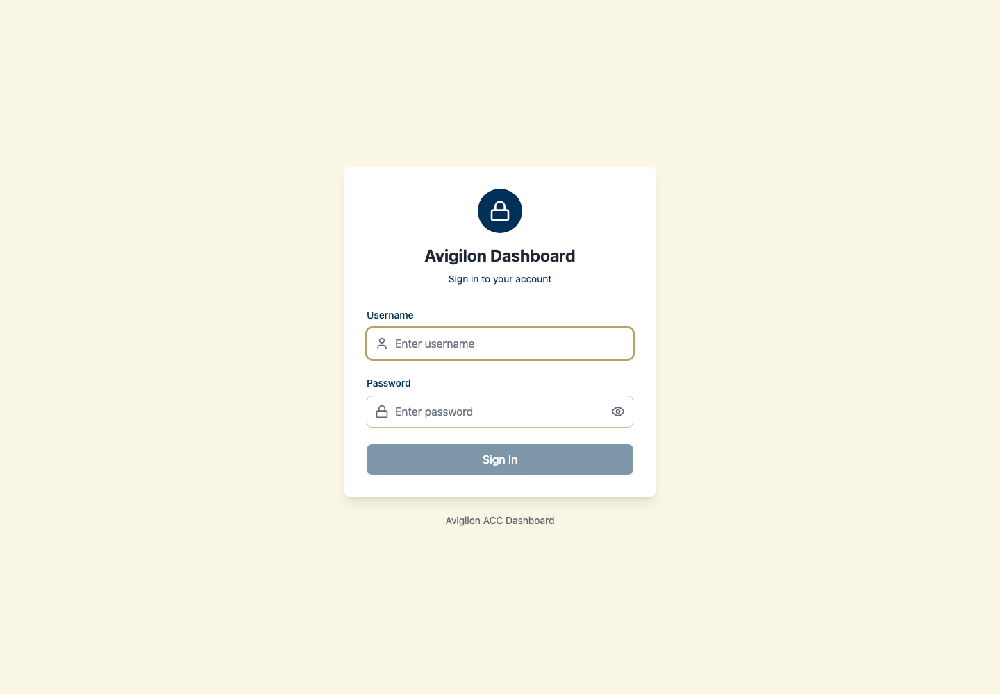
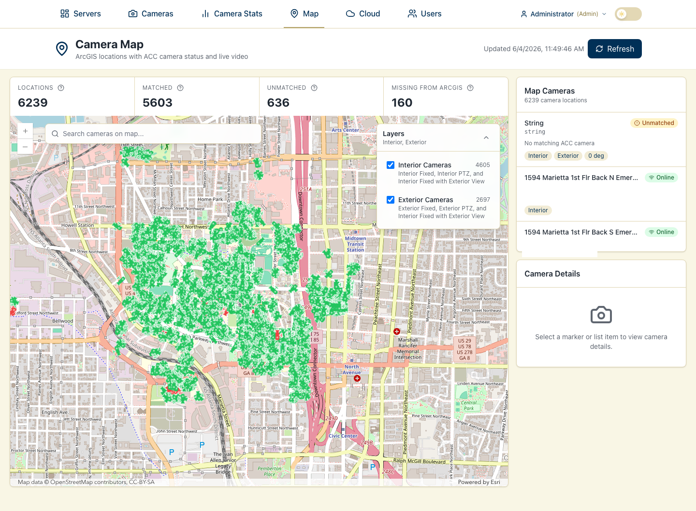
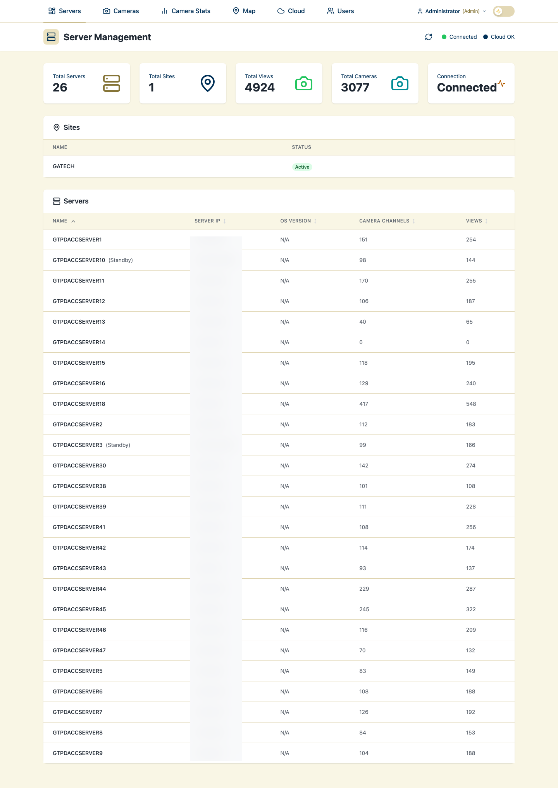
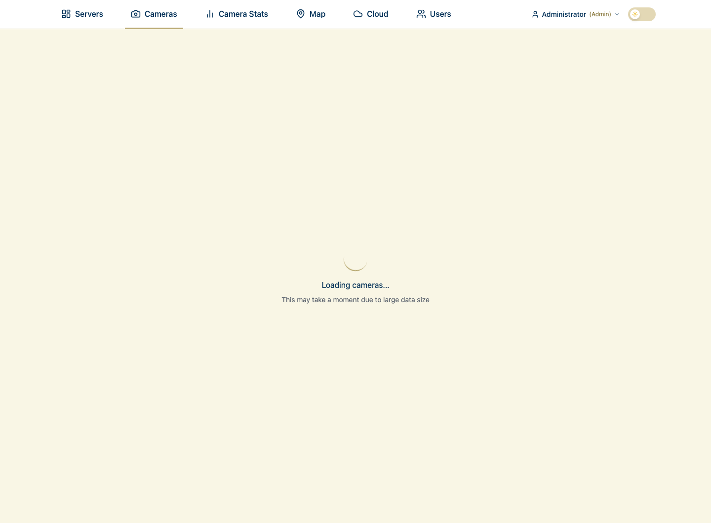
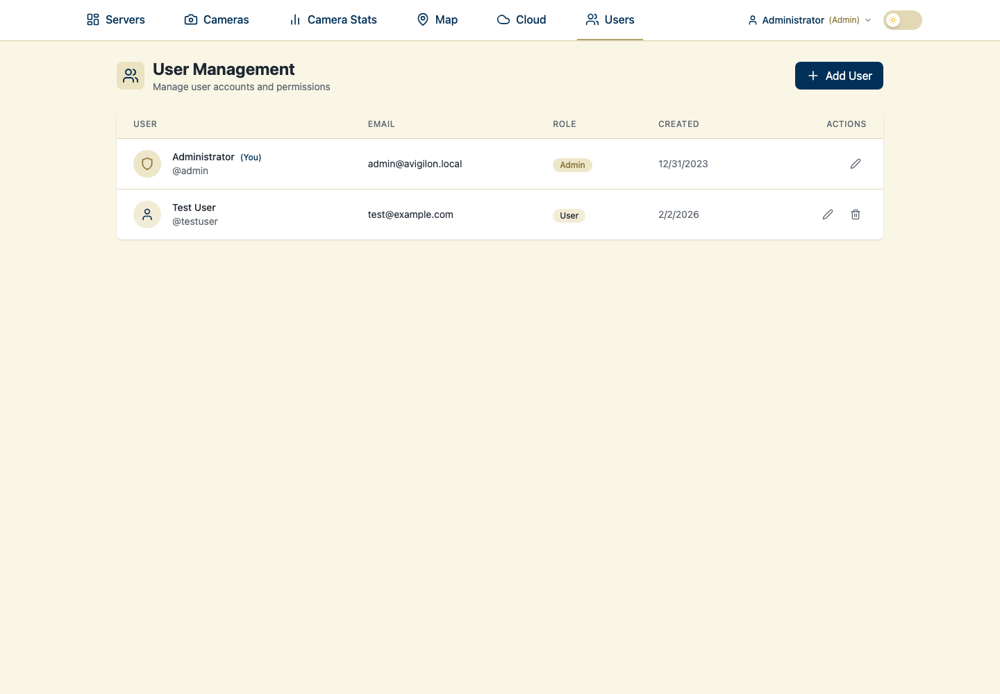

# GT CamHub

A full-stack web application for managing and monitoring Avigilon Control Center (ACC) cameras, ArcGIS camera locations, server inventory, and cloud/Zabbix hardware health. Built with React frontend, Node.js backend, and an automated cloud token fetcher.

## Screenshots

### Login Page


### Camera Map


### Server Management


### Cameras View


### User Management (Admin)


## Features

- **User Authentication**: Secure JWT-based login with role-based access control
- **Admin User Management**: Create, edit, and delete user accounts (admin only)
- **Map-First Workflow**: Authenticated map is the default post-login view
- **ArcGIS Camera Map**: Read-only camera location feed from an ArcGIS Point FeatureLayer
- **Camera Layers**: Interior and exterior camera layer controls, including shared Interior Fixed w/ Exterior View cameras
- **Map Search and Details**: Filter map cameras by search text, zoom to matching cameras, inspect camera details, view snapshots, and launch live video
- **Server Management**: View system statistics, server inventory, Windows Server versions, camera channels, and site summary
- **Cloud Hardware Health**: Monitor PSUs, temperatures, cooling, disks, CPU, and memory via Avigilon Cloud HMS API
- **Zabbix Hardware Details**: Pull supplemental SNMP hardware and OS data from Zabbix
- **Automated Token Fetcher**: Docker sidecar that automatically captures cloud JWT tokens every 24 hours
- **Camera Statistics**: All four status cards filter the camera list by status, manufacturer, and model; manufacturer percentages count physical devices
- **Inventory Recovery**: Keep the last successful camera inventory during refresh failures and show when data is stale
- **Camera Management**: Browse all cameras, view snapshots, and manage camera settings
- **Site Information**: Access detailed information about ACC sites
- **Real-time Status**: Monitor connection status and camera availability
- **RESTful API**: Clean API interface to ACC Web Endpoint Service
- **Dark Mode**: Toggle between light and dark themes

## Prerequisites

Before you begin, ensure you have the following installed:

- **Docker and Docker Compose** (recommended for deployment)
- **Node.js 22** (matches the Docker images) — only needed for local development without Docker
- **Avigilon Control Center** (ACC 6 or ACC 7)
- **ACC Web Endpoint Service** installed on your ACC server
- **API Credentials**: User nonce and user key from Avigilon Technology Partner Program
- **Avigilon Cloud Account** (optional, for hardware health monitoring)
- **ArcGIS API key and Point FeatureLayer** (optional, for the camera map)
- **Zabbix API token** (optional, for SNMP hardware and OS details)

### Getting API Credentials

To use this application, you need to register for the Avigilon Technology Partner Program:

1. Visit the Avigilon Partner Portal
2. Register for API access
3. Obtain your `user_nonce` and `user_key`
4. Ensure the ACC Web Endpoint Service is installed on your ACC server

For more information, visit: https://support.avigilon.com/s/article/How-to-obtain-REST-API-SDK-Support

## Quick Start with Docker (Recommended)

### 1. Clone or Extract the Project

```bash
cd avigilon-dashboard
```

### 2. Configure Environment

```bash
cp backend/.env.example backend/.env
# Edit backend/.env with your credentials
```

**Configure your `backend/.env` file:**

```env
PORT=3001
NODE_ENV=production
# Generate each independently with: openssl rand -hex 32
JWT_SECRET=your_first_random_secret_at_least_32_characters
JWT_REFRESH_SECRET=your_second_distinct_random_secret_at_least_32_characters
# Only for a NEW account store; at least 12 characters, max 72 bytes.
BOOTSTRAP_ADMIN_PASSWORD=your_initial_admin_password

# Your ACC Server Details
ACC_SERVER_URL=https://your-acc-server-ip:8443
ACC_USERNAME=your_username
ACC_PASSWORD=your_password
ACC_USER_NONCE=your_user_nonce_from_avigilon
ACC_USER_KEY=your_user_key_from_avigilon

# Avigilon Cloud API (optional, for hardware health monitoring)
CLOUD_SITE_ID=your_cloud_site_id
CLOUD_TOKEN_SECRET=pick-a-secret-passphrase
CLOUD_EMAIL=your_cloud_portal_email
CLOUD_PASSWORD=your_cloud_portal_password

# Zabbix SNMP hardware monitoring (optional)
ZABBIX_URL=https://your-zabbix-server/zabbix/api_jsonrpc.php
ZABBIX_API_TOKEN=your_zabbix_api_token

# ArcGIS Camera Map (optional)
ARCGIS_FEATURE_LAYER_URL=https://your-arcgis-server/arcgis/rest/services/your-service/FeatureServer/0
ARCGIS_API_KEY=your_arcgis_api_key
ARCGIS_IP_FIELD=ipAddress
ARCGIS_LABEL_FIELD=name
ARCGIS_TYPE_FIELD=Type_of_Camera
ARCGIS_DIRECTION_FIELD=Direction_of_Camera__Degrees_
ARCGIS_REFERER=https://your-dashboard-host.example.edu
ARCGIS_CACHE_TTL_MS=3600000

# CORS Configuration
ALLOWED_ORIGINS=http://localhost,http://localhost:5173
```

Before starting nginx, place a certificate valid for your dashboard hostname at `certs/server.crt` and its private key at `certs/server.key`. The standard configuration redirects HTTP to HTTPS. Set `ALLOWED_ORIGINS` to include your dashboard's HTTPS origin.

### 3. Build and Start

```bash
docker compose build
docker compose up -d
```

### 4. Access the Application

- Frontend: `https://<your-dashboard-host>` (HTTP redirects to HTTPS)
- Backend health check on the Docker host: `http://127.0.0.1:3001/api/health`. Remote clients access the API through the frontend HTTPS proxy.

### 5. Login

For a new install, sign in as `admin` with the password you set in `BOOTSTRAP_ADMIN_PASSWORD`. There is no shared default password. Remove that bootstrap variable after the first account is created.

For an existing install, preserve `backend/src/data/users.json` before updating the checkout, then restore it into that ignored runtime path before starting the service. This release removes the old tracked account file. Existing account IDs and password hashes are retained; all users sign in again to establish revocable sessions. See [migration and test deployment notes](docs/security-reliability-test.md) for migration and rollback details.

## Docker Architecture

```
┌──────────────────────────────────────────────────────────────────┐
│                       Docker Network                             │
│                                                                  │
│  ┌──────────────┐        ┌──────────────────────┐               │
│  │   Frontend   │        │      Backend         │               │
│  │   (nginx)    │ ────>  │   (Node.js/Express)  │               │
│  │  Ports 80/443│        │      Port 3001       │               │
│  └──────────────┘        └──────────────────────┘               │
│                                    ▲                             │
│                                    │ POST /api/cloud/token-submit│
│                          ┌─────────┴────────────┐               │
│                          │   Token Fetcher      │               │
│                          │  (Python/Playwright) │               │
│                          │   Runs every 24hrs   │               │
│                          └──────────────────────┘               │
└──────────────────────────────────────────────────────────────────┘
```

**Services:**
- **Frontend**: nginx serving the React build, proxies `/api/` requests to the backend
- **Backend**: Node.js Express API with health checks, ACC proxy, ArcGIS map feed, Zabbix integration, and cloud API integration
- **Token Fetcher**: Python sidecar with headless Chromium that automates Avigilon Cloud login to capture JWT tokens. Runs every 24 hours and supports on-demand refresh via the Cloud page.
- **Data persistence**: User data stored in a mounted volume (`backend/src/data/`)

### Docker Commands

```bash
# Build images
docker compose build

# Start containers (detached)
docker compose up -d

# View logs for all services
docker compose logs -f

# View token-fetcher logs specifically
docker compose logs -f token-fetcher

# Stop containers
docker compose down

# Rebuild and restart
docker compose up -d --build
```

## Cloud Hardware Health Monitoring

The dashboard integrates with the Avigilon Cloud HMS (Health Monitoring Service) API to display hardware health data for each server, including:

- **Power Supplies**: Status, location, and health state
- **Temperature Probes**: Current readings and sensor status
- **Cooling Devices**: Fan status and health
- **Disk Arrays**: Drive state, serial number, and SMART alerts
- **CPU Usage**: System CPU and ACC process CPU percentages
- **Memory Usage**: Used/total with percentage breakdown

### How It Works

1. The **token-fetcher** container launches a headless Chromium browser and logs into `us.cloud.avigilon.com` using your cloud credentials
2. It intercepts the internal HMS JWT token from API requests made during the session
3. The token is submitted to the backend, which immediately fetches and caches health data for all servers (24-hour cache)
4. The token itself expires after ~1 hour, but the cached health data persists on the dashboard until the next refresh cycle
5. Every 24 hours, the process repeats automatically

### Manual Token Refresh

You can trigger a manual token refresh from the **Cloud** page in the dashboard by clicking the **Refresh Token** button. This is useful if you need fresh health data before the next automatic cycle.

## ArcGIS Camera Map

The Map page uses ArcGIS as the authoritative read-only source for camera locations and map metadata. The backend keeps the ArcGIS API key server-side, refreshes the FeatureLayer feed on an hourly cache interval by default, joins records to ACC cameras by normalized IP address, and exposes a dashboard-ready map feed.

Map features include:

- Interior and exterior camera layer toggles
- Camera direction icons from the ArcGIS direction field
- Search that filters markers and zooms to matching cameras
- Camera detail panel with ACC status, ArcGIS metadata, snapshot, and live video launch
- Data quality counts for unmatched ArcGIS records and ACC cameras missing from ArcGIS

## Local Development (Without Docker)

### Backend Setup

```bash
cd backend
npm ci
cp .env.example .env
# Edit .env with your credentials
npm run dev  # Uses nodemon for auto-reload
```

The backend will start on `http://localhost:3001`

### Frontend Setup

```bash
cd frontend
npm ci
npm run dev  # Vite dev server with HMR
```

The frontend will start on `http://localhost:5173`

## Validation

Run `npm ci` followed by `npm test` separately in `backend/` and `frontend/`. Run `npm run build` in `frontend/` to verify the production bundle. Run `npm audit --omit=dev` in each directory to check production dependencies.

Regression tests cover account/session security, concurrent account changes, ACC login recovery, stale inventory, token renewal, camera statistics filtering, thumbnail cleanup, and PDF export.

## Project Structure

```
avigilon-dashboard/
├── backend/
│   ├── src/
│   │   ├── controllers/
│   │   │   ├── avigilonController.js    # ACC request handlers
│   │   │   ├── cloudController.js       # Cloud API handlers
│   │   │   ├── mapController.js         # ArcGIS map feed handlers
│   │   │   ├── authController.js        # Login/logout handlers
│   │   │   └── userController.js        # User CRUD handlers
│   │   ├── middleware/
│   │   │   └── authMiddleware.js        # JWT verification
│   │   ├── routes/
│   │   │   ├── api.js                   # ACC & Cloud API routes
│   │   │   └── auth.js                  # Auth routes
│   │   ├── services/
│   │   │   ├── avigilonService.js       # ACC API integration
│   │   │   ├── arcgisMapService.js      # ArcGIS FeatureLayer integration
│   │   │   ├── cloudApiService.js       # Cloud HMS API integration
│   │   │   ├── zabbixService.js         # Zabbix API integration
│   │   │   ├── cloudApiServiceInstance.js # Cloud service singleton
│   │   │   └── authService.js           # JWT & user management
│   │   ├── data/
│   │   │   └── users.json               # User data storage
│   │   └── index.js                     # Express server
│   ├── Dockerfile
│   ├── .env.example
│   └── package.json
│
├── frontend/
│   ├── src/
│   │   ├── components/
│   │   │   ├── ThemeToggle.jsx          # Dark mode toggle
│   │   │   └── ProtectedRoute.jsx       # Auth route guard
│   │   ├── context/
│   │   │   ├── ThemeContext.jsx          # Theme state
│   │   │   └── AuthContext.jsx          # Auth state
│   │   ├── pages/
│   │   │   ├── CameraMap.jsx            # ArcGIS-backed camera map
│   │   │   ├── Dashboard.jsx            # Server management and health
│   │   │   ├── CloudSettings.jsx        # Cloud connection management
│   │   │   ├── Cameras.jsx              # Cameras page
│   │   │   ├── CameraStats.jsx          # Camera statistics page
│   │   │   ├── Login.jsx                # Login page
│   │   │   └── UserManagement.jsx       # User admin page
│   │   ├── services/
│   │   │   ├── apiService.js            # ACC, Map, Zabbix & Cloud API client
│   │   │   └── authService.js           # Auth API client
│   │   ├── App.jsx                      # Main app component
│   │   ├── main.jsx                     # Entry point
│   │   └── index.css                    # Global styles
│   ├── Dockerfile
│   ├── nginx.conf
│   └── package.json
│
├── token-fetcher/
│   ├── fetch_token.py                   # Playwright login & token capture
│   ├── Dockerfile                       # Python/Playwright Docker image
│   └── requirements.txt                 # Python dependencies
│
├── docker-compose.yml                   # Docker orchestration (3 services)
│
└── docs/
    └── screenshots/                     # Application screenshots
```

## API Endpoints

### Authentication Routes (Public)

| Method | Endpoint | Description |
|--------|----------|-------------|
| POST | `/api/auth/login` | Login with username/password |
| POST | `/api/auth/refresh` | Refresh access token |

### Authentication Routes (Protected)

| Method | Endpoint | Description |
|--------|----------|-------------|
| POST | `/api/auth/logout` | Revoke the current session |
| GET | `/api/auth/me` | Get current user info |
| PUT | `/api/auth/profile` | Update your profile |
| PUT | `/api/auth/profile/password` | Change your password and revoke your sessions |

### User Management Routes (Admin Only)

| Method | Endpoint | Description |
|--------|----------|-------------|
| GET | `/api/auth/users` | List all users |
| POST | `/api/auth/users` | Create new user |
| PUT | `/api/auth/users/:id` | Update user |
| DELETE | `/api/auth/users/:id` | Delete user |

### ACC API Routes (Protected)

| Method | Endpoint | Description |
|--------|----------|-------------|
| GET | `/api/health` | Health check (public) |
| GET | `/api/test-connection` | Test ACC connection |
| GET | `/api/server` | Get ACC server information |
| GET | `/api/cache/status` | Get inventory cache age and refresh status |
| POST | `/api/cache/refresh` | Refresh inventory; retain last successful data on failure |
| GET | `/api/server/ids` | Get server IDs |
| GET | `/api/servers` | Get all servers |
| GET | `/api/servers/:serverId` | Get server details |
| GET | `/api/servers/:serverId/extended` | Get extended server info |
| GET | `/api/sites` | Get all sites |
| GET | `/api/sites/:siteId` | Get site by ID |
| GET | `/api/cameras` | Get all cameras |
| GET | `/api/cameras/:cameraId` | Get camera details |
| GET | `/api/cameras/:cameraId/snapshot` | Get camera snapshot |
| GET | `/api/dashboard/stats` | Get dashboard statistics |

### Camera Map Routes (Protected)

| Method | Endpoint | Description |
|--------|----------|-------------|
| GET | `/api/map/cameras` | Get ArcGIS-backed camera map feed joined to ACC camera data |
| POST | `/api/map/refresh` | Force refresh of the read-only ArcGIS map cache (admin only) |

### Cloud API Routes (Protected)

| Method | Endpoint | Description |
|--------|----------|-------------|
| POST | `/api/cloud/token` | Set cloud JWT token |
| GET | `/api/cloud/status` | Get cloud connection status |
| DELETE | `/api/cloud/token` | Clear cloud token |
| GET | `/api/cloud/servers` | List cloud servers |
| GET | `/api/cloud/servers/:serverId` | Get cloud server details |
| GET | `/api/cloud/health-summary` | Get all servers' health data |
| POST | `/api/cloud/refresh-token` | Trigger manual token refresh |

### Zabbix Routes (Protected)

| Method | Endpoint | Description |
|--------|----------|-------------|
| GET | `/api/zabbix/status` | Get Zabbix connection status |
| GET | `/api/zabbix/servers` | Get Zabbix server hardware/OS summary |
| GET | `/api/zabbix/servers/:ipOrName` | Get Zabbix hardware details for a server |
| POST | `/api/zabbix/missing-import` | Generate import data for servers missing from Zabbix |

### Recording Availability Routes (Protected, Experimental)

These backend routes are retained for research, but recording headroom/capacity is not currently displayed in the UI.

| Method | Endpoint | Description |
|--------|----------|-------------|
| GET | `/api/servers/recording-availability` | Get latest read-only recording availability estimates |
| GET | `/api/servers/recording-availability/history` | Get recording availability history or CSV export |
| POST | `/api/servers/recording-availability/refresh` | Trigger manual recording availability refresh (admin only) |

## Configuration

### Backend Environment Variables

| Variable | Description | Required |
|----------|-------------|----------|
| `PORT` | Server port (default: 3001) | No |
| `NODE_ENV` | Environment (development/production); Docker uses production | No |
| `JWT_SECRET` | Random access-token signing secret, at least 32 characters | Yes |
| `JWT_REFRESH_SECRET` | Different random refresh-token signing secret, at least 32 characters | Yes |
| `BOOTSTRAP_ADMIN_PASSWORD` | Initial admin password, 12 characters minimum and 72 bytes maximum; remove after account creation | New account store only |
| `TRUST_PROXY` | Set to `1` only behind the single trusted proxy; standard Compose sets this for nginx | No |
| `ACC_SERVER_URL` | ACC server URL with port | Yes |
| `ACC_USERNAME` | ACC username | Yes |
| `ACC_PASSWORD` | ACC password | Yes |
| `ACC_USER_NONCE` | API nonce from Avigilon | Yes |
| `ACC_USER_KEY` | API key from Avigilon | Yes |
| `ZABBIX_URL` | Zabbix API URL | For Zabbix features |
| `ZABBIX_API_TOKEN` | Zabbix API token | For Zabbix features |
| `ARCGIS_FEATURE_LAYER_URL` | ArcGIS camera FeatureLayer URL | For map features |
| `ARCGIS_API_KEY` | ArcGIS API key | For map features |
| `ARCGIS_IP_FIELD` | ArcGIS field containing camera IP address | For map features |
| `ARCGIS_LABEL_FIELD` | Optional ArcGIS display label field | No |
| `ARCGIS_TYPE_FIELD` | Optional ArcGIS camera type/layer field | No |
| `ARCGIS_DIRECTION_FIELD` | Optional ArcGIS direction/bearing field | No |
| `ARCGIS_REFERER` | Optional referrer header for restricted ArcGIS keys | No |
| `ARCGIS_CACHE_TTL_MS` | ArcGIS cache refresh interval in milliseconds | No |
| `CLOUD_SITE_ID` | Avigilon Cloud site ID | For cloud features |
| `CLOUD_TOKEN_SECRET` | Shared secret for token submission | For cloud features |
| `CLOUD_EMAIL` | Avigilon Cloud portal email | For cloud features |
| `CLOUD_PASSWORD` | Avigilon Cloud portal password | For cloud features |
| `RECORDING_AVAILABILITY_INTERVAL_MS` | Experimental recording availability collection interval | No |
| `RECORDING_AVAILABILITY_SAMPLE_SIZE` | Experimental camera sample size per server | No |
| `RECORDING_AVAILABILITY_LOOKBACK_DAYS` | Experimental timeline lookback window | No |
| `RECORDING_AVAILABILITY_HISTORY_LIMIT` | Experimental history limit | No |
| `ALLOWED_ORIGINS` | Comma-separated CORS origins | No |

## Security Notes

1. **Never commit `.env` files** — Keep your credentials secure
2. **Use HTTPS in production** — Enable SSL/TLS for both frontend and backend
3. **User Authentication** — 15-minute access tokens renew within a seven-day persisted session. Logout revokes the current session; password changes, role changes, and account deletion revoke all sessions for that account.
4. **Password Security** — Passwords hashed with bcrypt (10 salt rounds)
5. **Rate limiting** — API limits plus a separate limit of 20 failed login attempts per 15 minutes per client IP
6. **CORS configuration** — Update allowed origins for production
7. **Account storage** — No default password. Back up the ignored `backend/src/data/users.json`, which contains users and sessions, before upgrading. Run only one backend process against this file. The last administrator cannot be deleted or demoted.
8. **Cloud credentials** — The token-fetcher runs on an internal Docker network; cloud credentials are used server-side to sign in to Avigilon Cloud
9. **ArcGIS credentials** — The ArcGIS API key stays backend-side and is never exposed directly to the frontend

## Troubleshooting

### Connection Failed

**Problem:** Cannot connect to ACC server

**Solutions:**
1. Verify ACC Web Endpoint Service is running on your ACC server
2. Check `ACC_SERVER_URL` in `.env` is correct
3. Ensure firewall allows connections to ACC server port
4. Verify your ACC credentials are correct
5. Check that your user_nonce and user_key are valid

### No Cloud Health Data

**Problem:** Server detail modal shows no hardware health

**Solutions:**
1. Check `docker compose logs token-fetcher` for login errors
2. Verify `CLOUD_EMAIL` and `CLOUD_PASSWORD` in `.env` are correct
3. Verify `CLOUD_SITE_ID` matches your Avigilon Cloud site
4. Check screenshots in `token-fetcher/screenshots/` for login flow debugging
5. Try clicking **Refresh Token** on the Cloud page

### Token Fetcher Login Fails

**Problem:** Token-fetcher cannot log into Avigilon Cloud

**Solutions:**
1. Verify your cloud portal credentials work at https://us.cloud.avigilon.com
2. Check for MFA/2FA requirements on the cloud account
3. Review screenshots saved to `token-fetcher/screenshots/` for visual debugging
4. Check `docker compose logs token-fetcher` for detailed error messages

### CORS Errors

**Problem:** CORS policy blocking requests

**Solutions:**
1. Add your frontend URL to `ALLOWED_ORIGINS` in backend `.env`
2. Restart the backend server after changing `.env`

### Camera Map Does Not Load

**Problem:** Map page loads but no camera locations appear

**Solutions:**
1. Verify `ARCGIS_FEATURE_LAYER_URL` points to the correct Point FeatureLayer or layer index
2. Confirm `ARCGIS_API_KEY` has access to the selected ArcGIS item
3. Confirm `ARCGIS_IP_FIELD` matches the FeatureLayer field containing camera IP addresses
4. Check backend logs for ArcGIS 403/404 errors
5. Click **Refresh** on the Map page after ArcGIS item or API key changes

### Dashboard Sign-In or Startup Fails

Sign in again after upgrading or after a password/role change. Existing account passwords are preserved. If the backend refuses to start, check that both signing secrets are configured, distinct, and at least 32 characters. A new account store also requires `BOOTSTRAP_ADMIN_PASSWORD`; an existing installation must restore its account backup before starting.

### ACC Authentication Failed

**Problem:** The dashboard cannot authenticate to ACC

**Solutions:**
1. Verify `ACC_USER_NONCE` and `ACC_USER_KEY` are correct
2. Ensure you're registered in the Avigilon Technology Partner Program
3. Check ACC user credentials have proper permissions

## Technologies Used

### Backend
- **Express.js** — Web framework
- **Axios** — HTTP client for ACC and Cloud APIs
- **Helmet** — Security middleware
- **CORS** — Cross-origin resource sharing
- **dotenv** — Environment configuration

### Frontend
- **React 18** — UI library
- **Vite** — Build tool
- **React Router** — Routing
- **Tailwind CSS** — Styling
- **Lucide React** — Icons
- **ArcGIS Maps SDK for JavaScript** — Interactive camera map
- **Axios** — API client

### Token Fetcher
- **Python 3** — Runtime
- **Playwright** — Browser automation for cloud login
- **Chromium** — Headless browser (bundled in Docker image)

### Infrastructure
- **Docker & Docker Compose** — Container orchestration
- **nginx** — Frontend static file serving and API proxy

## Future Enhancements

- [x] Live video streaming
- [ ] PTZ camera controls
- [ ] Event notifications
- [ ] Alarm management
- [ ] Recording playback
- [x] User authentication and authorization
- [x] Docker containerization
- [x] Cloud hardware health monitoring
- [x] ArcGIS camera map
- [x] Zabbix OS and hardware details
- [x] Automated cloud token management
- [ ] Multi-site support
- [x] Mobile responsive improvements
- [ ] Real-time camera status updates via WebSocket
- [ ] Export camera snapshots
- [ ] Bulk camera operations

## License

This project is for demonstration and development purposes. Ensure compliance with Avigilon's API terms and conditions.

## Support

For ACC API documentation and support:
- Visit: https://docs.avigilon.com
- Support: https://support.avigilon.com

For application issues:
- Check the troubleshooting section above
- Review container logs: `docker compose logs -f`
- Verify your ACC server is accessible and Web Endpoint Service is running

## ACC Web Endpoint Service Installation

The ACC Web Endpoint Service must be installed on the same system as your ACC Server:

1. Download the appropriate version:
   - ACC 6: https://www.avigilon.com/support-and-downloads/
   - ACC 7: https://www.avigilon.com/support-and-downloads/

2. Install the service on your ACC Server machine

3. Verify the service is running on the configured port (default: 8080)

## Getting Started Checklist

- [ ] Docker and Docker Compose installed
- [ ] ACC Server accessible on the network
- [ ] ACC Web Endpoint Service installed
- [ ] Obtained user_nonce and user_key from Avigilon
- [ ] (Optional) Avigilon Cloud account credentials for health monitoring
- [ ] (Optional) ArcGIS FeatureLayer URL and API key configured for the Map page
- [ ] (Optional) Zabbix API token configured for server OS/hardware details
- [ ] `backend/.env` configured with credentials
- [ ] Containers built: `docker compose build`
- [ ] Containers running: `docker compose up -d`
- [ ] TLS certificate and key installed; dashboard HTTPS origin allowed
- [ ] Application accessible at its configured HTTPS hostname
- [ ] Distinct random signing secrets configured
- [ ] Existing account store backed up before upgrade, or new admin created with a private bootstrap password
- [ ] Bootstrap password removed from the environment after account creation
